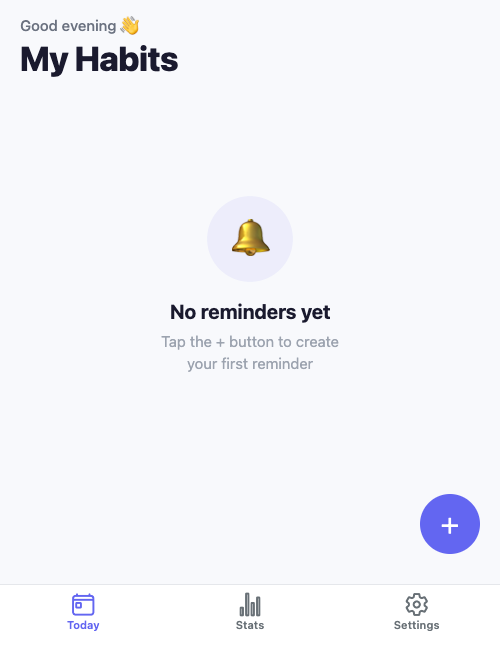
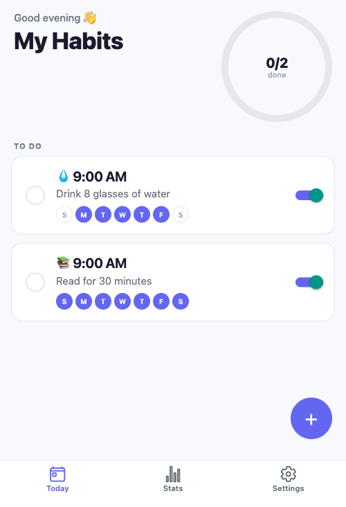
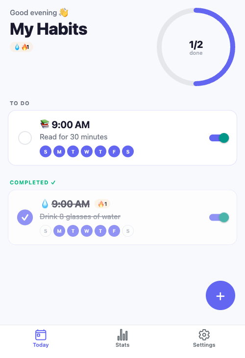
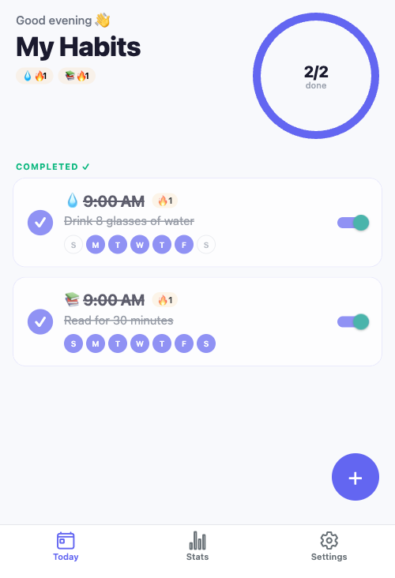
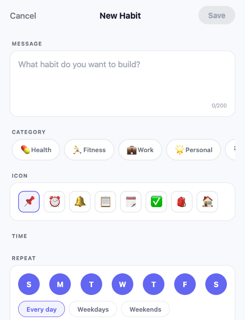
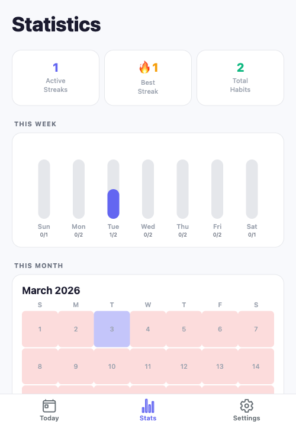
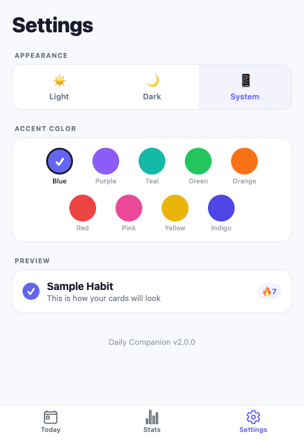
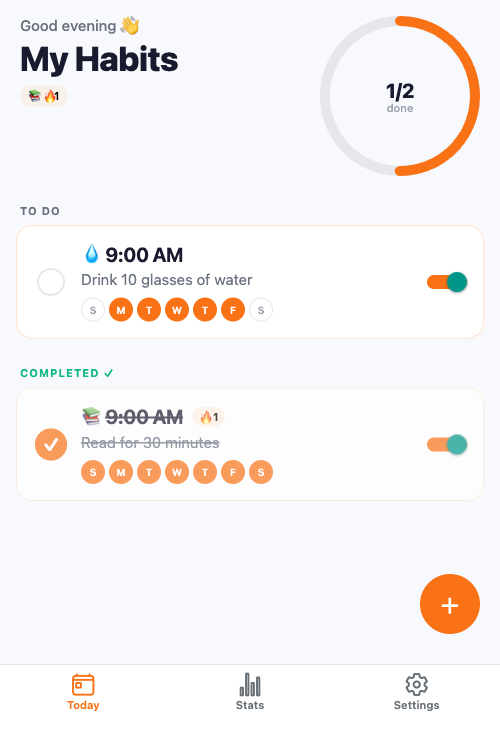

<p align="center">
  
</p>

<h1 align="center">Daily Companion</h1>

<p align="center">
  <strong>A beautiful, offline-first habit tracker built with React Native & Expo</strong>
</p>

<p align="center">
  
  
  
  
  
</p>

---

## Screenshots

<p align="center">
  
  
  
  
</p>

<p align="center">
  
  
  
  
</p>

---

## Features

### Habit Management
- Create habits with custom messages, categories, icons, and schedules
- 6 built-in categories: Health, Fitness, Work, Personal, Learning, Other
- Context-aware icon picker that updates based on selected category
- Flexible scheduling: Every day, Weekdays, Weekends, or custom day selection
- Enable/disable habits without deleting them

### Daily Tracking
- Clean "Today" dashboard with progress ring showing daily completion
- One-tap completion checkbox with haptic feedback
- Habits auto-sorted into TO DO, COMPLETED, PAUSED, and OTHER DAYS sections
- Pull-to-refresh and automatic reload on app foreground
- Confetti celebration when all daily habits are completed

### Streaks & Stats
- Automatic streak calculation that only counts scheduled days
- Streak milestones: Getting Started (3 days), One Week (7), One Month (30), Unstoppable (100)
- Weekly bar chart showing completions per day
- Monthly heatmap calendar
- Streak leaders leaderboard

### Notifications
- Daily/weekly push notifications at your chosen time
- "Mark as Done" quick action directly from the notification
- Automatic re-sync of all notifications on app launch
- Per-habit notification management

### Theming
- Light, Dark, and System appearance modes
- 9 accent color presets: Blue, Purple, Teal, Green, Orange, Red, Pink, Yellow, Indigo
- Live preview card in Settings
- Theme persists across sessions

### Data & Privacy
- 100% offline — no account, no server, no internet required
- SQLite database with WAL mode for performance
- Automatic migration from legacy AsyncStorage format
- Swipe-to-delete with confirmation dialog
- Your data stays on your device

---

## Tech Stack

| Layer | Technology |
|-------|-----------|
| Framework | [Expo SDK 54](https://expo.dev) + [React Native 0.81](https://reactnative.dev) |
| Routing | [Expo Router](https://docs.expo.dev/router/introduction/) (file-based) |
| Database | [expo-sqlite](https://docs.expo.dev/versions/latest/sdk/sqlite/) (SQLite with WAL) |
| Notifications | [expo-notifications](https://docs.expo.dev/versions/latest/sdk/notifications/) |
| Gestures | [react-native-gesture-handler](https://docs.swmansion.com/react-native-gesture-handler/) |
| Charts | Custom SVG components via [react-native-svg](https://github.com/software-mansion/react-native-svg) |
| Haptics | [expo-haptics](https://docs.expo.dev/versions/latest/sdk/haptics/) |
| Language | TypeScript 5.9 with React Compiler |

---

## Getting Started

### Prerequisites

- [Node.js](https://nodejs.org/) 18+
- [Expo CLI](https://docs.expo.dev/get-started/installation/)
- iOS Simulator (macOS) or Android Emulator

### Installation

```bash
# Clone the repository
git clone https://github.com/rajatjangid/reminder-app.git
cd reminder-app

# Install dependencies
npm install

# Start the dev server
npm start
```

### Run on Device/Emulator

```bash
# iOS Simulator
npm run ios

# Android Emulator
npm run android

# Web Browser
npm run web
```

### Build APK

```bash
# Local build (requires Android SDK)
npm run build:apk

# Cloud build via EAS
npm run build:apk:cloud
```

---

## Project Structure

```
reminder-app/
├── app/                          # Expo Router screens
│   ├── _layout.tsx               # Root layout (providers, init, notification sync)
│   ├── add-reminder.tsx          # Create/edit habit modal
│   └── (tabs)/
│       ├── _layout.tsx           # Tab navigator
│       ├── index.tsx             # Today dashboard
│       ├── stats.tsx             # Statistics screen
│       └── settings.tsx          # Theme settings
├── components/
│   ├── HabitCard.tsx             # Habit card with checkbox, swipe, toggle
│   ├── ProgressRing.tsx          # SVG circular progress
│   ├── CategoryPicker.tsx        # Category selection chips
│   ├── IconPicker.tsx            # Emoji icon grid
│   ├── DaySelector.tsx           # Day picker with presets
│   ├── WeeklyBarChart.tsx        # Weekly stats visualization
│   ├── MonthlyHeatMap.tsx        # Calendar heatmap
│   ├── Confetti.tsx              # Celebration animation
│   ├── Toast.tsx                 # Transient notifications
│   └── EmptyState.tsx            # No habits placeholder
├── services/
│   ├── database.ts               # SQLite CRUD operations
│   ├── notifications.ts          # Push notification scheduling
│   ├── streaks.ts                # Streak calculation engine
│   ├── migration.ts              # Legacy data migration
│   └── logger.ts                 # Dev-mode structured logging
├── contexts/
│   └── ThemeContext.tsx           # Theme provider (mode + accent)
├── hooks/
│   └── use-app-theme.ts          # Theme color hook
├── constants/
│   └── theme.ts                  # Color palette generator
├── types/
│   └── habit.ts                  # TypeScript interfaces
└── assets/
    ├── images/                   # App icons and splash
    └── screenshots/              # App screenshots
```

---

## Data Model

### Habits Table

| Column | Type | Description |
|--------|------|-------------|
| `id` | TEXT PK | Timestamp-based unique ID |
| `message` | TEXT | Habit description (max 200 chars) |
| `hour` | INTEGER | Notification hour (0-23) |
| `minute` | INTEGER | Notification minute (0-59) |
| `days` | TEXT (JSON) | Scheduled days `[1=Sun..7=Sat]` |
| `enabled` | INTEGER | Active/paused flag |
| `notificationIds` | TEXT (JSON) | Expo notification identifiers |
| `category` | TEXT | health, fitness, work, personal, learning, other |
| `icon` | TEXT | Emoji icon |
| `streak` | INTEGER | Current consecutive days |
| `bestStreak` | INTEGER | All-time best streak |
| `createdAt` | INTEGER | Unix timestamp |

### Completions Table

| Column | Type | Description |
|--------|------|-------------|
| `habitId` | TEXT FK | References habits(id) CASCADE |
| `date` | TEXT | Completion date (YYYY-MM-DD) |
| `completed` | INTEGER | Boolean flag |

---

## How It Works

### Streak Calculation
Streaks are calculated by walking backward from today through scheduled days. If today is a scheduled day and not yet completed, the streak starts from yesterday. Non-scheduled days (e.g., weekends for a weekday-only habit) are skipped and don't break the streak.

### Notification Sync
On every app launch, all notifications are cancelled and rescheduled to ensure consistency. Notification IDs are persisted in the database so the "Mark as Done" quick action can match the correct habit.

### Theme Engine
The `getColors()` function generates a complete color palette from a base scheme (light/dark) and an accent hex color. This palette flows through `ThemeContext` to every component via the `useAppTheme()` hook.

---

## Dev-Mode Logging

The app includes a structured logging system that outputs color-coded, timestamped logs in development:

```
✅ [14:32:01.234] [DB] Habit INSERTED: "Drink water"
🔍 [14:32:01.250] [STREAK] "Drink water" → streak=3, best=7
✅ [14:32:01.260] [NOTIFY] Scheduled "Drink water" → 7 notification(s)
⚠️ [14:32:01.280] [MIGRATE] Skipped: already migrated
```

Available loggers: `dbLog`, `notifyLog`, `streakLog`, `migrateLog`, `appLog`, `themeLog`. All output is suppressed in production builds via the `__DEV__` flag.

---

## Contributing

1. Fork the repository
2. Create your feature branch (`git checkout -b feature/amazing-feature`)
3. Commit your changes (`git commit -m 'Add amazing feature'`)
4. Push to the branch (`git push origin feature/amazing-feature`)
5. Open a Pull Request

---

## License

This project is licensed under the [MIT License](LICENSE).

---

<p align="center">
  Made with React Native + Expo
</p>
